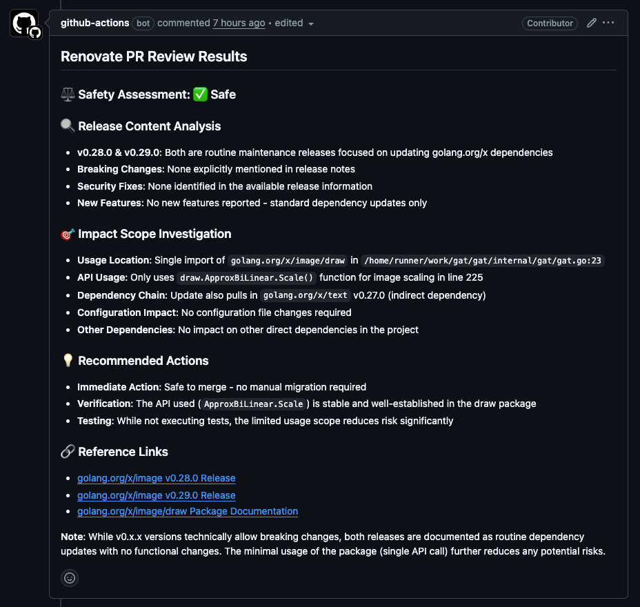

# Claude Renovate Review Action

[](./LICENSE)
[](./.github/workflows/release-please.yml)

Review Renovate PRs using Claude Code.



## Usage

```yaml
name: Claude Renovate Review

on:
  pull_request:
    types:
      - opened
      - edited

jobs:
  claude-renovate-review:
    if: github.event.pull_request.user.login == 'renovate[bot]'
    runs-on: ubuntu-latest
    permissions:
      contents: read
      pull-requests: write # for commenting on the PR
    steps:
      - uses: actions/checkout@v4
      - uses: koki-develop/claude-renovate-review@v1
        with:
          anthropic-api-key: ${{ secrets.ANTHROPIC_API_KEY }}
          # or
          claude-code-oauth-token: ${{ secrets.CLAUDE_CODE_OAUTH_TOKEN }}
```

## Inputs

| Name                      | Description                                                                                                           | Required | Default                                                                        |
| ------------------------- | --------------------------------------------------------------------------------------------------------------------- | -------- | ------------------------------------------------------------------------------ |
| `anthropic-api-key`       | Anthropic API key for Claude Code                                                                                     | No\*     | -                                                                              |
| `claude-code-oauth-token` | Claude Code OAuth token (alternative to anthropic-api-key)                                                            | No\*     | -                                                                              |
| `github-token`            | GitHub token with repo and pull request permissions                                                                   | No       | `${{ github.token }}`                                                          |
| `create-comment`          | Create the review result as a comment on the pull request                                                             | No       | `true`                                                                         |
| `pull-request-number`     | The number of the pull request to review. If not provided, it will use the pull request number from the event context | No       | -                                                                              |
| `allowed-tools`           | Newline-separated list of allowed tools for Claude Code. Each tool should be on a separate line                       | No       | `WebFetch(domain:github.com)`<br/>`WebFetch(domain:raw.githubusercontent.com)` |

\* Either `anthropic-api-key` or `claude-code-oauth-token` must be provided.

## Outputs

| Name     | Description                                |
| -------- | ------------------------------------------ |
| `report` | The review report generated by Claude Code |

## License

[MIT](./LICENSE)
